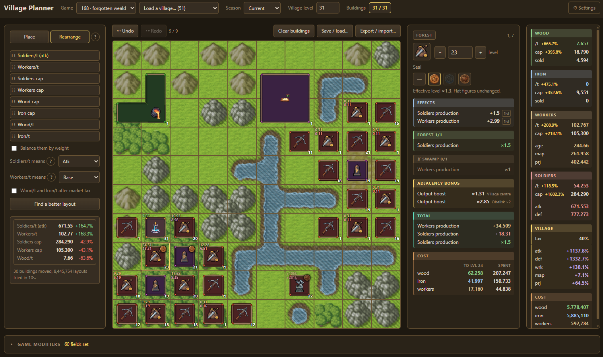

# Factions solver

A layout planner and optimiser for [Factions](https://www.factions-online.com),
and a simulator that plays a round out tick by tick.




## Building

Needs a C++23 compiler, CMake 4.1.2+, [cpp-httplib](https://github.com/yhirose/cpp-httplib),
[emsdk](https://emscripten.org) on `PATH`, and Python 3. `terser` and `node`
with `jsdom` are optional, for minification and the page tests.

```sh
FACTIONS_TOKEN=... tools/fetch-games.py --rules --players
cmake -S . -B build && cmake --build build -j8
build/Server 8080        # then open http://localhost:8080
```

## The two pages

`/` is the planner: arrange a village and read what it produces, or search for
a better arrangement.

`/simulator.html` is the simulator: the same village played forward from the
first tick of a round, where every price has to be produced before it can be
paid. Nothing takes time to construct, so a tick is the only clock. It applies
the build-menu unlocks, the slot budget, the storage capacities, the recycling
refund, the seasons (one every 3240 ticks, each taking 0.99 off every upgrade
price) and the seals, each of which is blocked for 100 ticks after it is
fitted.

A run is a starting point and a list of steps, held as one script the engine
reads; the page writes the script and draws the reply, so the rules live in
`src/simulate.cpp` alone. `build/Harness simulate <script>` runs one without a
browser, which is what `tests/scripts` holds.

The page reads a run back the way a game of chess is read back: the steps are
listed beside the board and clicking one shows the village as it stood after
it. A wait is a step like any other, so the clock is part of the record rather
than a setting beside it; two waits in a row are one wait, and carrying the
same building twice is one carry. Anything standing can be dragged to another
tile, the centre included, and turned with R. None of that costs anything, so
where a village stands is never a commitment: only what it has bought is.
