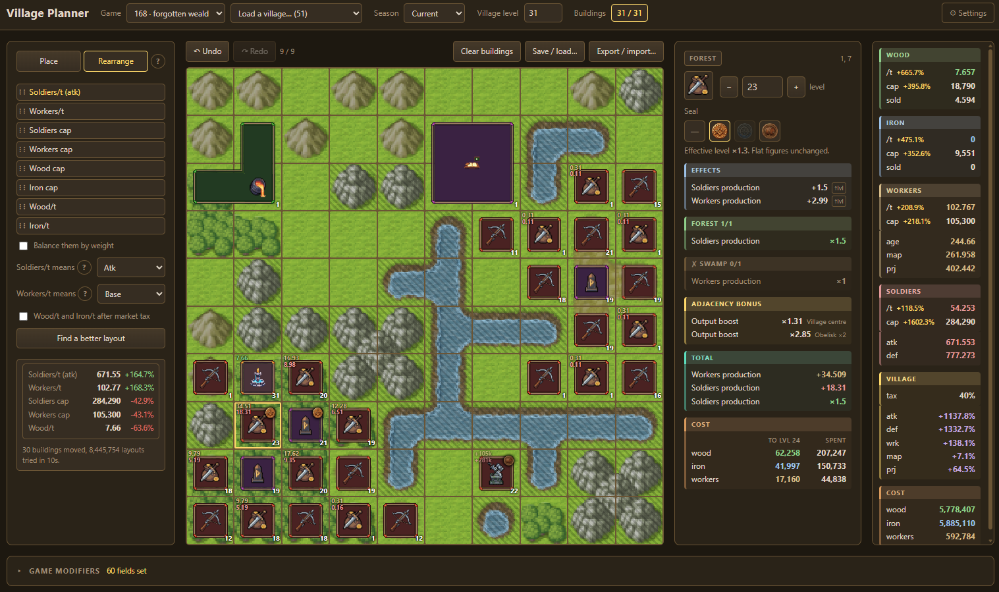

# Factions solver

A layout planner and optimiser for [Factions](https://www.factions-online.com)



## Building

Needs a C++23 compiler, CMake 4.1.2+,
[emsdk](https://emscripten.org) on `PATH`, and Python 3. `terser` and `node`
with `jsdom` are optional, for minification and the page tests.

```sh
FACTIONS_TOKEN=... tools/fetch-games.py --rules --players
cmake -S . -B build && cmake --build build -j$(nproc)
python3 -m http.server -d build/site 8080   # then open http://localhost:8080
```
